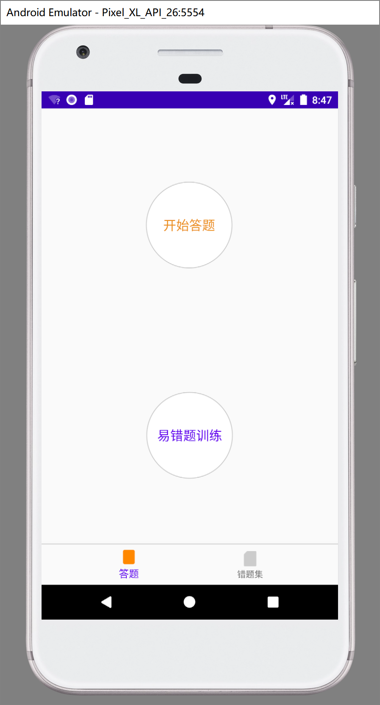
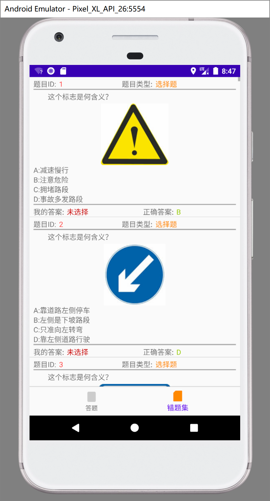
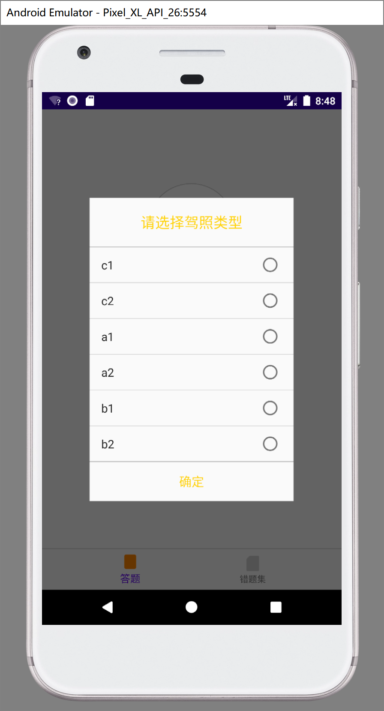
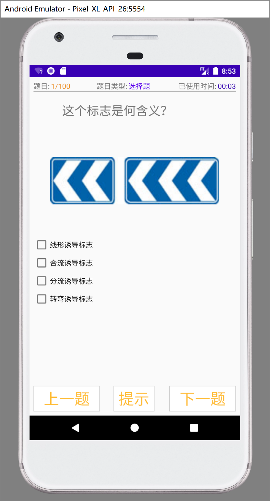
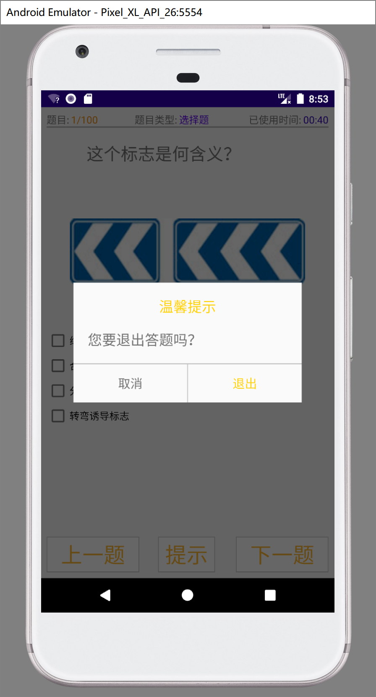
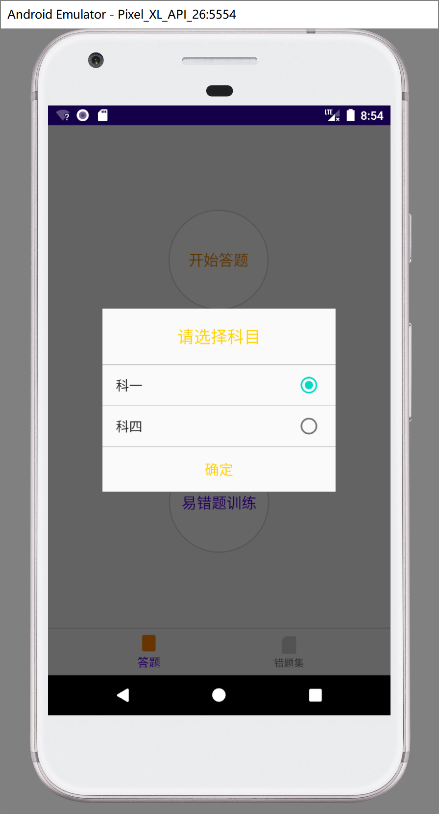

# DrivingLicenseExercise
基于 聚合数据 驾照题库API 开发的一个简单的APP。拥有科一、科四，C2到A1题库，计分、错题训练等基本功能

## 请自行修改DLAPI.java 中的 聚合数据API KEY 方可访问聚合数据API接口

[聚合数据驾照题库API申请](https://www.juhe.cn/docs/api/id/183)

运行界面示例:

copyright 2021-2022
